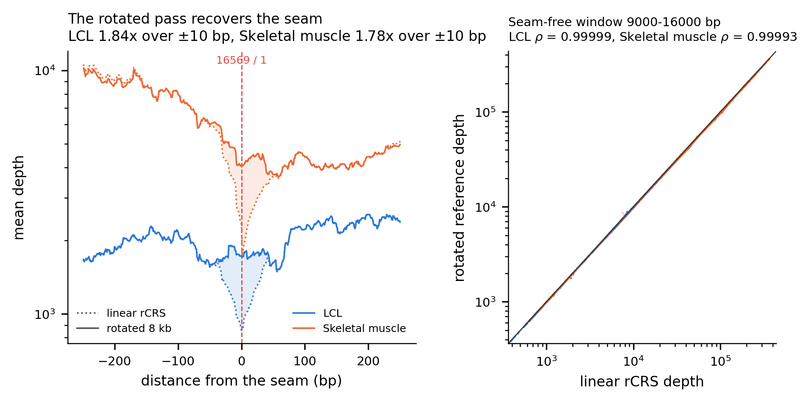
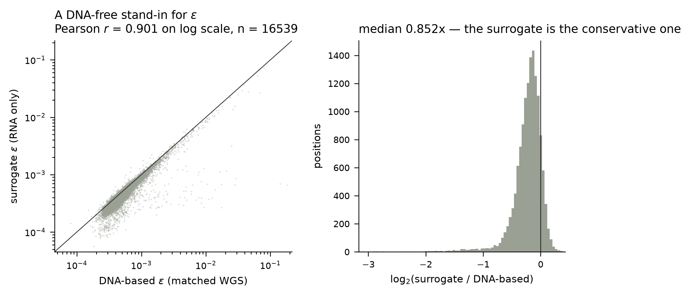

# MitoFeasible

**Where in the mitochondrial genome can variants be called from bulk RNA-seq?**

A position-level feasibility assessment of mitochondrial variant detection in bulk RNA-seq, measured in three independent cohorts.

A study, and the tool it produced.

---

## What this is

chrM reads are present in essentially every RNA-seq dataset and are routinely discarded at QC as a quality nuisance. mtDNA is transcribed almost end to end, so unlike the nuclear genome every one of its 16,569 positions is represented in RNA — in our data at 7,700-23,300x the enrichment its length would predict, and at 400-3,000x the depth of a typical whole-genome sequencing run.

That depth is not evenly spread, and three artefact sources sit at the same magnitude as the signal. This project measures where the depth is real.

The output is not the observation that chrM coverage is non-uniform — that is known. It is a **feasibility map**: for each position, the lowest allele fraction at which a variant call there is supported.

## What this is not

- Not a heteroplasmy discovery study
- Not a disease-association study
- Not a variant caller — no competition with mgatk, mutserve, or MToolBox
- No biological interpretation of any variant observed

Scope discipline is deliberate. The value of this project is a validated foundation, not a finding.

## Cohorts

| | Primary | Replication | Chemistry control |
|---|---|---|---|
| Accession | PRJEB3366 (GEUVADIS) | PRJNA1051137 (GSE249921) | PRJNA1086804 |
| Material | Lymphoblastoid cell lines | Skeletal muscle biopsy | Post-mortem DLPFC, bulk, neurotypical controls |
| mtDNA content | Low (4.1% of reads) | High (12.5%) | chemistry-dependent, by design |
| Samples | 30 donors | 30 donors, resting biopsy only | 38 = 19 blocks x 2 chemistries, 10 donors |
| Chemistry | poly(A) | poly(A), stranded | **paired: every block poly(A) *and* rRNA-depleted** |
| Reads | 75 bp PE, ~26M | 101 bp PE, ~55M | 101 bp PE, ~45M |
| Role | Error rate, map | Does the map transfer? | Does chemistry move the map? |

GEUVADIS carries what nothing else on the shortlist does: the same individuals have 1000 Genomes whole-genome sequence, so the error rate can be **measured** rather than assumed.

**Stated limitations.** Tissue and study are confounded by construction — no public BioProject spans low to high mitochondrial content in healthy bulk tissue at usable sample size, and controlled-access data is out of scope. Any difference between the arms is tissue effect plus batch effect, inseparable. The first two cohorts are both poly(A); the chemistry stratum is therefore carried by a third cohort in which chemistry is the only variable, at the cost of being a different tissue (post-mortem brain) with no matched DNA. Its magnitudes should not be read as transferring to LCL or muscle — what transfers is the direction and the non-uniformity across the molecule. All of this is reported, not modelled away.

## Design

| Element | Choice | Reason |
|---|---|---|
| Donors | Healthy only for the map | Disease confounds technical variation at this stage; the chemistry control relaxes this, and is reported separately |
| Cohorts | One primary + one independent replication, separate BioProjects | The map must be shown not to be a single-project artefact |
| Chemistry | A third cohort carrying both library types within one study | Comparing chemistries across studies would confound them with everything else |
| Reference | rCRS, NC_012920.1 | Field standard; all coordinates reported against it |
| Alignment | Run twice, NUMT-masked and unmasked | The difference is a primary result |
| Circularity | Second chrM rotated by 8,000 bp | The linear reference's seam sits inside the control region |
| Error rate | Measured per position against matched DNA | It is not a constant, and assuming one biases the central figure |

## Pipeline

| Phase | Script | Output |
|---|---|---|
| 0 | `00_literature_scan.md` | Does this study already exist? **Stop for review.** |
| 1 | `01_bioproject_scan.py` | Candidate cohorts. **Stop for review.** |
| 2 | `02_download.py` | Raw FASTQ, every file md5-verified against ENA |
| 3 | `03a_prepare_reference.py`, `03_align.sh` | Alignments A (NUMTs intact) / B (masked), plus a shifted-chrM pass |
| 4 | `04_coverage.py` | Per-base and per-gene coverage, strand-resolved, two MAPQ thresholds |
| 5 | `05_numt_delta.py` | Where masking changes the picture |
| 6 | `06_haplogroup.py`, `06b_truth_compare.py` | Haplogroups, checked against the donors' own DNA |
| 7 | `07a_allele_counts.py`, `07_feasibility_map.py` | Measured error rate; position × condition detection limits |
| — | `mitofeasible.py` | **The released tool** |
| 8 | `08_replication.py` | Does the map transfer to the held-out cohort? |
| 9 | `09_figures.py`, `09b_circularity.py` | Figures and manuscript materials |
| + | `11_indel_at_homopolymers.py` | Is the poly-C noise length ambiguity reaching a substitution pileup? |
| + | `12_chemistry.py` | poly(A) vs rRNA depletion: yield, composition, detection limits |

Phases 0 and 1 halt for human review. Cohort selection is a scientific decision, not an automation step.

## MitoFeasible

The tool the study produced. It answers one question for a chrM alignment: at
each position, what is the lowest allele fraction a call there would support?

The per-position error rate measured here ships with it — that is the half a
user cannot derive from their own data. Depth is read from their BAM, because
depth does not transfer between datasets at all. `chrM`, `MT` and
`NC_012920.1` are all accepted as sequence names; a reference of any length
other than 16,569 is refused, since the map's coordinates are defined on rCRS.

Usage is in [Using this repository](#using-this-repository).

## Method figures

Two figures document alignment and estimator decisions rather than findings. The
results and the figures that carry them are in the manuscript, not here.



rCRS is linear but the molecule is circular, so the 16569/1 seam — which falls
inside the control region — loses reads. Every chrM read is therefore realigned
to a second reference rotated by 8,000 bp, and control-region depth is read from
that pass. Left: depth either side of the junction, linear (dotted) against
rotated (solid). Right: the two passes in a window clear of both seams, where
they agree at ρ ≥ 0.9999 — the check that the rotation recovers reads without
disturbing anything else.



The error rate is measured against the donors' own whole-genome data, which only
the primary cohort has. Cohorts without matched DNA use an RNA-only estimator
instead: the median non-reference fraction across donors. This is the validation
of that substitution, in the one cohort where both can be computed — it tracks
the DNA-anchored estimate and errs low, so limits derived from it are
conservative rather than optimistic.

## Using this repository

Three things people want from it, in ascending order of cost.

### 1. Apply the tool to your own data — minutes, no cluster

`scripts/mitofeasible.py` works from a plain clone. It needs `pysam` and `scipy`
and nothing else; it reads no config, and the measured error rate ships with it.

```bash
python3 scripts/mitofeasible.py --selftest            # no data needed
python3 scripts/mitofeasible.py your_chrM.bam -o feasibility.tsv
python3 scripts/mitofeasible.py your.bam --calls your_calls.tsv
```

or from Python:

```python
from mitofeasible import feasibility

m = feasibility("sample.bam")
m.loc[4500]
# depth 47, min_detectable_af 0.112  →  a 3% signal there is noise
```

Depth comes from your BAM, the error rate from this study — that split is the
point, since the error rate is the half you cannot derive from your own data.
`--calls` flags positions where a call you already made is below the limit.

### 2. Check the numbers, redraw what you can — minutes, no cluster

The derived tables are committed, so the published numbers can be recomputed
without re-running anything:

```bash
python3 -c "import pandas as pd; e=pd.read_csv('results/tables/error_rate_per_position.tsv',sep='\t'); print(e.epsilon.median(), (e.epsilon>1e-3).sum())"
python3 scripts/09_figures.py --config config/params.yaml
```

The figure script redraws whatever its inputs allow and names what it skipped:
the large per-sample intermediates are not published, so figures built on those
are reported as skipped rather than crashing the run. The circularity figure has
its own script and its cached profile is committed, so it redraws in full:

```bash
python3 scripts/09b_circularity.py --config config/params.yaml
```

### 3. Re-run the pipeline — ~200 GB, days

```bash
./run_all.sh                 # print the phase order and the exact invocations
./run_all.sh selftest        # 14 selftests, no data required
apptainer build mitofeasible.sif env/mitofeasible.def
DRY=1 ./run_all.sh all       # print every command without running it
./run_all.sh 2 3 4           # then run phases
```

`run_all.sh` is the entry point: the pipeline table above says what each phase
does, that script says how it was called. Several invocations are not guessable
from the scripts alone.

To run it anywhere else, export `MTCOV_ROOT` (scratch, for the big
intermediates) and `MTCOV_REPO` (this checkout). Nothing needs editing: every
directory in `config/params.yaml` is written as `${MTCOV_ROOT}/...` and expanded
at load time, and the batch scripts read the same two variables through
`scripts/_env.sh`.

`run_all.sh` sets `MTCOV_REPO` from its own location and exports it, so running
the pipeline through it needs only `MTCOV_ROOT`. Invoking a batch script by hand
needs both, and says which one is missing rather than guessing: a batch script
cannot locate itself, because SLURM copies it to the node's spool directory
before running it.

Neither has a default. Both `plan` and `selftest` still work in a bare clone,
and so does everything in paths 1 and 2 above, which read only what is committed
here; anything that touches scratch stops and names the variable it wants.

**With a scheduler.** The `.slurm` files are this study's actual submissions and
are kept as the record of how the work ran. They are thin wrappers — pick a row
from the manifest, skip finished work, take a lock, call the Python — so adapt
them rather than read around them. Job logs go to `logs/` relative to the submit
directory, which `run_all.sh` creates; submitting one by hand means changing to
`$MTCOV_ROOT` first.

Four things are tuned to the cluster this ran on and are yours to change:

| | Where | What to do |
|---|---|---|
| Queue | `#SBATCH --partition=barbun` | Export `MTCOV_PARTITION`; `run_all.sh` passes it as `-p`, which overrides the header. Submitting a file directly still inherits `barbun`, so edit the header if you do that. |
| Account / QoS | not present | Many sites require `--account=` or a QoS. There is no hook for it: add the directive to the files you use. |
| Resource shape | `--nodes=1`, `--ntasks-per-node=20` or `40`, `--time=…`, and `alignment.limit_bam_sort_ram` in `config/params.yaml` | Sized for 20–40 core nodes with ≥96 GB. Alignment reads its thread count from `SLURM_CPUS_ON_NODE` and adapts; index building takes `alignment.threads` from the config and does not. |
| Container | `env/mitofeasible.def` | Bootstraps from a public Docker image, so building it needs network access and unprivileged user namespaces on the build host. Where the login node allows neither, build elsewhere and copy the `.sif` to `$MTCOV_SIF`. |

Nothing above blocks a dry run: `DRY=1 ./run_all.sh all` prints every command,
with your paths substituted, without submitting anything.

**Without one.** Set `MTCOV_LOCAL=1` and the array jobs become sequential loops
in the current shell:

```bash
export MTCOV_ROOT=/data/mitofeasible MTCOV_REPO=$PWD
MTCOV_LOCAL=1 ./run_all.sh 4          # the 60-sample array, one at a time
SLURM_ARRAY_TASK_ID=7 bash scripts/04_coverage.slurm    # or a single sample
```

Nothing is submitted, so each phase finishes before it returns, and every script
skips work whose output already exists — a loop interrupted halfway resumes
where it stopped. This is the same code the cluster runs, started differently;
there is no separate local pipeline to drift out of step.

What it does not do is make the work small. Phase 3 is STAR against GRCh38 for
60 samples twice over: ~30 GB of RAM for the index alone, ~200 GB of disk, and
days on one machine. Phases 4–9 are minutes to hours and are comfortable
locally; phases 2 and 3 are why this study used a cluster, and no amount of
scheduling changes that.

If `apptainer` or the image is missing, the scripts say so once and fall back to
whatever is on `PATH`. That is deliberate — a missing container should not look
like a broken checkout — but the versions are then unpinned and the numbers may
move. `env/versions.lock` is what produced the published ones.

**The environment.** `env/mitofeasible.def` builds the analysis container from a
public base, pinned by digest rather than by tag so that the starting point
cannot move under it; `scripts/truba_build_container.sh` builds the same thing
on TRUBA, from a base image that exists only on that cluster. `x86_64` only: the
lock pins bioconda builds of STAR and samtools that exist for `linux-64` alone.
`env/environment.yml` pins majors and is the file to edit when adding a
dependency, while `env/versions.lock` is the exact package set the published
results came from (STAR 2.7.11b, samtools 1.24, scipy 1.17.1, …) and is what the
definition file installs. Move those and the numbers move with them.

The image carries the environment and none of the analysis code — only
`versions.lock` is copied in. Code comes from the clone, versions from the
image, which is why one image serves every revision of the scripts and why
fixing a script does not mean rebuilding it.

The container is for the pipeline. The released tool needs `pysam` and `scipy`
and nothing else, so path 1 above deliberately does not go through it.

On a shared filesystem that forbids conda installs — TRUBA does — the container
is the only sanctioned route, and `environment.yml` is a manifest rather than an
environment.

**A cohort of your own.** The chemistry control runs through the same scripts
with three overrides, so a cohort outside `config/params.yaml` needs no new
code: `MTCOV_MANIFEST` (its own sample table), `MTCOV_FQDIR` (a flat FASTQ
directory rather than one per run) and `MTCOV_ARMS=A` (skip the NUMT-masked arm
where that contrast is not the question). Phases 4 and 7a take matching `--arms`
and `--stranded` flags. That cohort is deliberately *not* added to
`cohorts.studies`: phase 8 picks the replication cohort as "the study that is
not the primary one", and a third entry would silently change that.

All parameters live in `config/params.yaml`; nothing is hardcoded in analysis
logic. Every non-trivial script carries a selftest that runs without data —
`--selftest`, except `06_haplogroup.py`, where it is a positional mode.

## Layout

```
config/       params.yaml, samples.tsv
ref/          gene and NUMT BED files, cohort metadata
scripts/      numbered pipeline stages + mitofeasible.py
results/      tables/, figures/
logs/         every run parameterised and logged
```

Intermediates live on scratch. Only chrM BAM subsets and derived tables are kept.

## Definition of done

The study is complete when, for any position, this can be said with a number
attached:

> From this region, at this depth and library type, heteroplasmy is detectable
> down to X%. From that region, it is not detectable at any threshold.

That requires four things the pipeline must produce rather than assume: the
coverage landscape, a per-position error rate measured against matched DNA, the
feasibility map built from the two, and a test of whether the map transfers to a
cohort it was not built on. A fifth, the library-chemistry axis, is carried by a
separate cohort in which chemistry is the only variable.

Phases 0-9 are complete. The numbers are in the manuscript; the tables behind
them are in `results/tables/`.

## Conventions

- Coverage is expected to be highly non-uniform. Do not normalise with methods that assume otherwise — the non-uniformity is the finding.
- chrM reads are never filtered at QC, and duplicates are marked but never removed: at 16.6 kb, a high duplicate rate is saturation, not artefact.
- The error-rate assumption in Phase 7 is stated explicitly and run at multiple values as a sensitivity analysis. An unstated assumption there invalidates the central figure.
- Primary and replication cohorts are never merged before Phase 8, and the map is never tuned to force agreement.
- Negative and partial results are valid outputs and are reported as such.

## Reproducibility

Applies regardless of publication venue — these exist for the next three years of work built on this repo.

1. Tagged release matching the submitted manuscript
2. Full accession list as a supplementary table
3. Every alignment and analysis parameter logged and committed
4. Processed tables deposited with a Zenodo DOI
5. bioRxiv preprint posted at submission, not after acceptance

## Naming note

The project was developed as `mtcovmap`, which survives in the cluster paths, the
`MTCOV_*` environment variables and the container filename. Same project; only
the published name changed.

## Licence

MIT (code and the derived tables released here — see `LICENSE`). The underlying sequencing data remain under the terms of their originating repositories.
