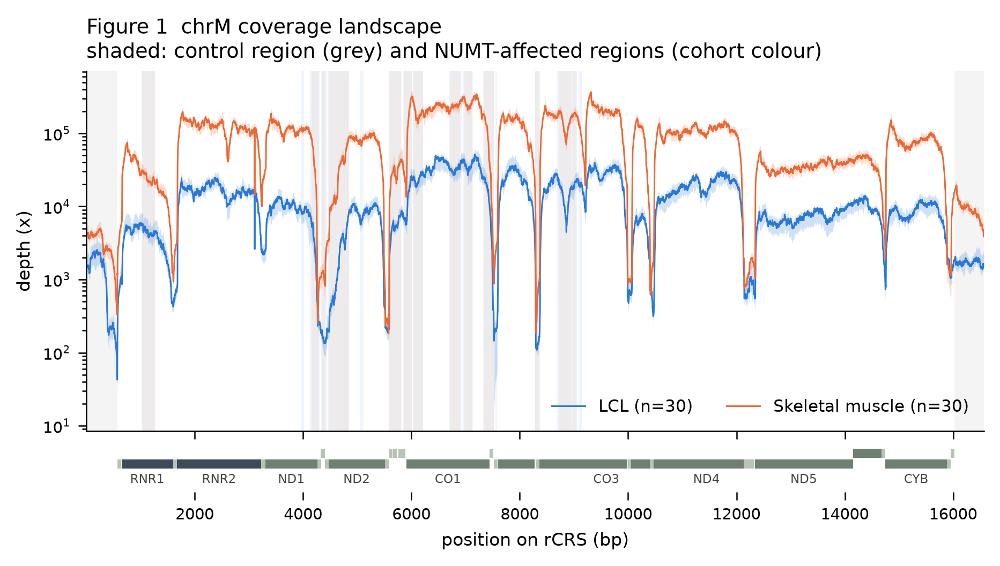
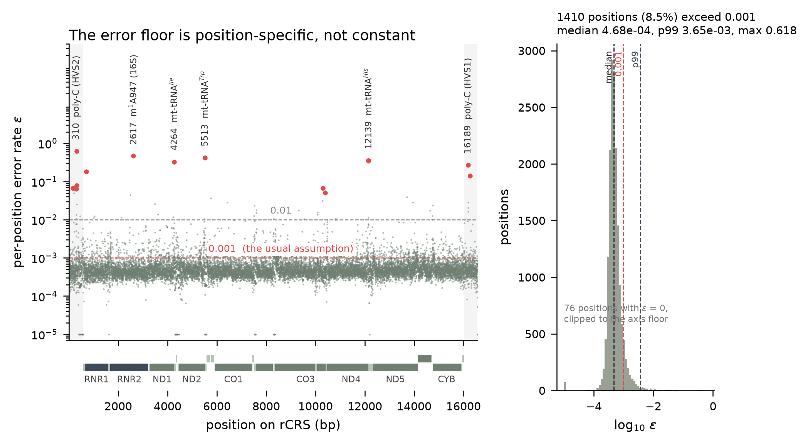
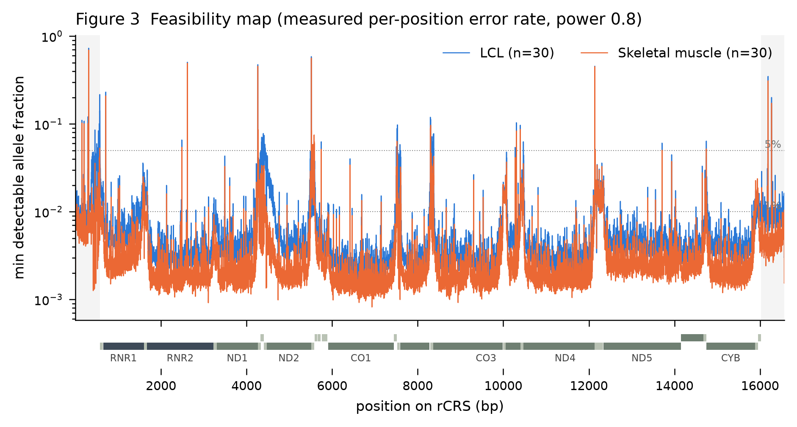
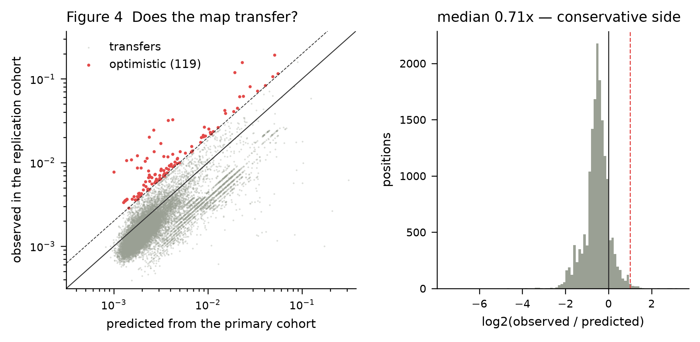
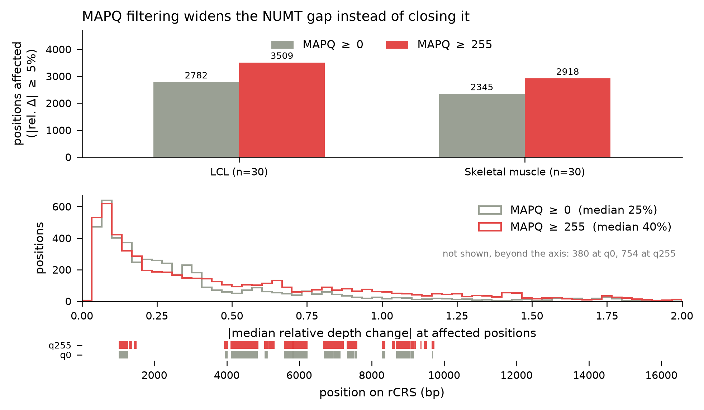
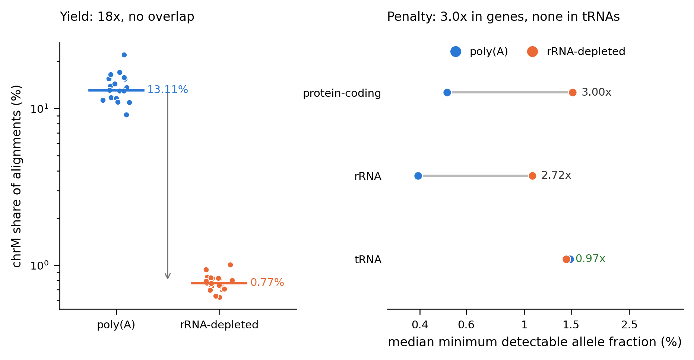

# MitoFeasible

**Where in the mitochondrial genome can variants be called from bulk RNA-seq?**

A position-level feasibility assessment of mitochondrial variant detection in bulk RNA-seq, measured in three independent cohorts.

A study, and the tool it produced.

---

## What this is

chrM reads are present in essentially every RNA-seq dataset and are routinely discarded at QC as a quality nuisance. mtDNA is transcribed almost end to end, so unlike the nuclear genome every one of its 16,569 positions is represented in RNA — in our data at 7,700-23,300x the enrichment its length would predict, and at 400-3,000x the depth of a typical whole-genome sequencing run.

That depth is not evenly spread, and three artefact sources sit at the same magnitude as the signal. This project measures where the depth is real.

The output is not the observation that chrM coverage is non-uniform — that is known. It is a **feasibility map**: for each position, the lowest allele fraction at which a variant call there is supported.

## What this is not

- Not a heteroplasmy discovery study
- Not a disease-association study
- Not a variant caller — no competition with mgatk, mutserve, or MToolBox
- No biological interpretation of any variant observed

Scope discipline is deliberate. The value of this project is a validated foundation, not a finding.

## Cohorts

| | Primary | Replication | Chemistry control |
|---|---|---|---|
| Accession | PRJEB3366 (GEUVADIS) | PRJNA1051137 (GSE249921) | PRJNA1086804 |
| Material | Lymphoblastoid cell lines | Skeletal muscle biopsy | Post-mortem DLPFC, bulk, neurotypical controls |
| mtDNA content | Low (4.1% of reads) | High (12.5%) | 13.1% / 0.77% by chemistry |
| Samples | 30 donors | 30 donors, resting biopsy only | 38 = 19 blocks x 2 chemistries, 10 donors |
| Chemistry | poly(A) | poly(A), stranded | **paired: every block poly(A) *and* rRNA-depleted** |
| Reads | 75 bp PE, ~26M | 101 bp PE, ~55M | 101 bp PE, ~45M |
| Role | Error rate, map | Does the map transfer? | Does chemistry move the map? |

GEUVADIS carries what nothing else on the shortlist does: the same individuals have 1000 Genomes whole-genome sequence, so the error rate can be **measured** rather than assumed.

**Stated limitations.** Tissue and study are confounded by construction — no public BioProject spans low to high mitochondrial content in healthy bulk tissue at usable sample size, and controlled-access data is out of scope. Any difference between the arms is tissue effect plus batch effect, inseparable. The first two cohorts are both poly(A); the chemistry stratum is therefore carried by a third cohort in which chemistry is the only variable, at the cost of being a different tissue (post-mortem brain) with no matched DNA. Its magnitudes should not be read as transferring to LCL or muscle — what transfers is the direction and the non-uniformity across the molecule. All of this is reported, not modelled away.

## Design

| Element | Choice | Reason |
|---|---|---|
| Donors | Healthy only for the map | Disease confounds technical variation at this stage; the chemistry control relaxes this, and is reported separately |
| Cohorts | One primary + one independent replication, separate BioProjects | The map must be shown not to be a single-project artefact |
| Chemistry | A third cohort carrying both library types within one study | Comparing chemistries across studies would confound them with everything else |
| Reference | rCRS, NC_012920.1 | Field standard; all coordinates reported against it |
| Alignment | Run twice, NUMT-masked and unmasked | The difference is a primary result |
| Circularity | Second chrM rotated by 8,000 bp | The linear reference's seam sits inside the control region |
| Error rate | Measured per position against matched DNA | It is not a constant, and assuming one biases the central figure |

## Pipeline

| Phase | Script | Output |
|---|---|---|
| 0 | `00_literature_scan.md` | Does this study already exist? **Stop for review.** |
| 1 | `01_bioproject_scan.py` | Candidate cohorts. **Stop for review.** |
| 2 | `02_download.py` | Raw FASTQ, every file md5-verified against ENA |
| 3 | `03a_prepare_reference.py`, `03_align.sh` | Alignments A (NUMTs intact) / B (masked), plus a shifted-chrM pass |
| 4 | `04_coverage.py` | Per-base and per-gene coverage, strand-resolved, two MAPQ thresholds |
| 5 | `05_numt_delta.py` | Where masking changes the picture |
| 6 | `06_haplogroup.py`, `06b_truth_compare.py` | Haplogroups, checked against the donors' own DNA |
| 7 | `07a_allele_counts.py`, `07_feasibility_map.py` | Measured error rate; position × condition detection limits |
| — | `mitofeasible.py` | **The released tool** |
| 8 | `08_replication.py` | Does the map transfer to the held-out cohort? |
| 9 | `09_figures.py`, `09b_circularity.py` | Figures and manuscript materials |
| + | `11_indel_at_homopolymers.py` | Is the poly-C noise length ambiguity reaching a substitution pileup? |
| + | `12_chemistry.py` | poly(A) vs rRNA depletion: yield, composition, detection limits |

Phases 0 and 1 halt for human review. Cohort selection is a scientific decision, not an automation step.

## MitoFeasible

```python
from mitofeasible import feasibility

m = feasibility("sample.bam")
m.loc[4500]
# depth 47, min_detectable_af 0.112  →  a 3% signal there is noise
```

```bash
python scripts/mitofeasible.py sample.bam -o feasibility.tsv
python scripts/mitofeasible.py sample.bam --calls my_calls.tsv   # flags unsupported calls
```

The per-position error rate measured here ships with the tool; it is the half a user cannot derive from their own data. Depth is read from their BAM, because depth does not transfer between datasets at all. `chrM`, `MT` and `NC_012920.1` are all accepted as sequence names; a reference of any length other than 16,569 is refused, since the map's coordinates are defined on rCRS.

## Figures



**Figure 1.** Median per-base depth across chrM with the interquartile band, by cohort. Grey shading marks the control region, cohort-coloured shading the regions where NUMT masking moves depth by ≥5%. Gene track below, split by strand.



**Figure 2.** The measured per-position error rate, from 30 donors with matched DNA. It is not the constant the field assumes: it spans three orders of magnitude, 1,410 positions (8.5%) exceed 0.001, and the noisiest positions are recovered blind — 2617 is m<sup>1</sup>A947 in 16S rRNA, 4264/5513/12139 are mt-tRNA modification sites, and 310/16189 are the control-region poly-C tracts. This is why the feasibility map is per-position rather than per-depth.



**Figure 3.** The deliverable: the lowest allele fraction detectable at each position, using the measured per-position error rate at power 0.8. Spikes are positions where the error floor, not the depth, is the constraint. The broad rise around 4,300-4,600 in LCL is the largest NUMT-affected region recovered independently.



**Figure 4.** The map applied to the held-out cohort. Grey: positions where it transfers. Red: the 119 positions where it is optimistic by ≥2x, the failure mode that produces false positives. The dashed line is 2x; the bulk of the distribution sits below parity, meaning the map promises less than the cohort delivers.

### Supporting figures

These document decisions and controls rather than results.


**Figure 5.** rCRS is linear but the molecule is circular, so the 16569/1 seam — which falls inside the control region — loses reads. A second pass against a reference rotated by 8,000 bp recovers 1.8x the depth over the 10 bp either side of the junction, decaying to 1.3x by 50 bp, and agrees with the primary pass at ρ ≥ 0.9999 in a window clear of both seams.



**Figure 6.** Keeping only uniquely-mapped reads (MAPQ ≥ 255) is the usual defence against NUMT contamination. It does the opposite here: more positions move, and they move further. Reads shared between chrM and a NUMT are discarded on the unmasked reference but become unique once the NUMT is masked, so the filter widens the gap between the two arms rather than closing it.



**Figure 8.** What rRNA depletion costs, and where. Left: chrM share of alignments per sample; the two groups do not overlap. Right: median minimum detectable allele fraction by gene class, each pair joined, with the ratio between chemistries. The penalty is 2.7-3.0x in rRNA and protein-coding genes and absent in tRNAs, where the two chemistries coincide.


**Figure 7.** The replication cohort has no matched DNA, so its error floor is estimated from RNA alone as the median non-reference fraction across donors. Validated against the DNA-based estimate in the primary cohort, where both exist: the surrogate tracks it closely and errs low, making the transferred limits conservative rather than optimistic.

## Results so far

Phases 0-9 are complete. Headline numbers: n=60 for the map, plus a 24-sample chemistry control.

- **Coverage is not uniform, by a wide margin.** Per-sample coefficient of variation 0.80-0.90 (DNA sequencing gives ~0.10); p99/p01 dynamic range 345-544x. Within one sample, MT-CO1 runs 231x deeper than MT-TK.
- **NUMT masking matters, and it matters locally.** 2,345-2,782 positions shift by ≥5%, concentrated in 13-24 regions rather than spread out, with a median effect of 22-40% and a worst case of 13x at position 4,530. The direction is one-way: masking only ever adds depth. The two cohorts find almost the same positions (Jaccard 0.82) despite differing in tissue, lab, read length and depth.
- **Filtering on MAPQ is not a substitute for masking.** Keeping only uniquely-placed reads *widens* the A/B gap by 26%: a read shared with a NUMT scores MAPQ 3 and is dropped from A, while masking makes the same read unique in B.
- **The error rate is not a constant.** Measured against matched DNA: median 4.7×10⁻⁴, p99 3.7×10⁻³, maximum 0.62. 1,410 positions exceed the commonly assumed 0.1%. The noisiest positions recover known RNA-modification sites without being told to look — chrM 2617 is residue 947 of 16S rRNA, methylated by TRMT61B and long recognised as a source of RNA–DNA differences (Bar-Yaacov et al. 2016; surveyed across tissues by Wengert et al. 2024), alongside mt-tRNA positions and the control-region poly-C tracts.
- **Detection limits.** Median minimum detectable allele fraction 0.38% (LCL) and 0.21% (muscle); 87% and 93% of positions support detection at 1%. tRNAs are 4-5x worse than protein-coding genes.
- **The map transfers, and errs safe.** Applied to the held-out cohort: Spearman 0.80, median observed/predicted ratio 0.71. It is optimistic — the failure mode that produces false positives — at 119 positions (0.72%), listed in `results/tables/replication_optimistic_positions.tsv` rather than smoothed over.
- **Library chemistry moves the limit, and not uniformly.** 19 tissue blocks, each sequenced both ways, so donor and tissue cancel within a block. rRNA depletion cuts chrM yield 18x (median within-block ratio; 17x as a ratio of group medians) (13.1% to 0.77% of alignments, lower in 19/19 blocks) and median depth from 12,000x to 630x. Detection limits worsen 3.00x in protein-coding genes and 2.72x in rRNA — but 0.97x, indistinguishable, in tRNAs, whose relative share rises 5.5x within blocks (6.2x as a ratio of group medians). rRNA depletion is not better anywhere; it is merely free at the tRNAs.
- **Haplogroups match DNA in 30/30 donors**, to the subclade, and are identical between the masked and unmasked alignments in 60/60 samples. NUMT interference does not reach near-fixed variants; it lives entirely in the low-frequency signal.

## Quick start

```bash
./run_all.sh                 # the phase order, with the exact invocations
./run_all.sh selftest        # verify the logic without downloading anything
DRY=1 ./run_all.sh all       # print every command without running it
```

`run_all.sh` is the entry point: the README table says what each phase does, that
script says how it was called. Several invocations are not guessable from the
scripts alone — the chemistry cohort needs three environment overrides and two
flags.

The environment:

```bash
apptainer build mitofeasible.sif env/mitofeasible.def   # anywhere
bash scripts/truba_build_container.sh                   # on TRUBA only
```

`env/environment.yml` pins majors and is the file to edit when adding a
dependency. `env/versions.lock` is the exact package set the published results
came from (STAR 2.7.11b, samtools 1.24, scipy 1.17.1, …) and is what
`env/mitofeasible.def` installs; move those and the numbers move with them.

On a shared HPC filesystem that forbids conda installs (TRUBA does), the container is the only sanctioned route; `env/environment.yml` is then a manifest rather than an environment. `truba_build_container.sh` starts from a base image that exists only on that cluster, so use `env/mitofeasible.def` anywhere else — it builds the same environment from a public base.

All parameters live in `config/params.yaml`. Nothing is hardcoded in scripts. Every non-trivial script carries a selftest that runs without any data — `--selftest`, except `06_haplogroup.py`, where it is a positional mode (`python scripts/06_haplogroup.py selftest`).

**Running the pipeline elsewhere.** The tool works from a plain clone. The pipeline does not: `config/params.yaml` and the SLURM scripts carry this study's cluster layout. Edit the paths in that file (they share one prefix) and export `MTCOV_ROOT` (scratch) and `MTCOV_REPO` (the checkout) before submitting; the job scripts read both, defaulting to the paths used here.

**A second cohort in the same pipeline.** The chemistry control runs through the same scripts with three overrides, so a cohort outside `config/params.yaml` needs no new code: `MTCOV_MANIFEST` (its own sample table), `MTCOV_FQDIR` (flat FASTQ directory rather than one per run) and `MTCOV_ARMS=A` (skip the NUMT-masked arm where the NUMT contrast is not the question). Phases 4 and 7a take matching `--arms` and `--stranded` flags. The third cohort is deliberately *not* added to `cohorts.studies` in `config/params.yaml`: phase 8 picks the replication cohort as "the study that is not the primary one", and a third entry would silently change that.

## Layout

```
config/       params.yaml, samples.tsv
ref/          gene and NUMT BED files, cohort metadata
scripts/      numbered pipeline stages + mitofeasible.py
results/      tables/, figures/
logs/         every run parameterised and logged
```

Intermediates live on scratch. Only chrM BAM subsets and derived tables are kept.

## Definition of done

Four figures:

1. Coverage landscape across chrM, samples overlaid by tissue, with gene / NUMT / D-loop tracks
2. Measured per-position error rate, with the RNA-modification hotspots it recovers
3. **Feasibility map** — position vs. minimum detectable allele frequency
4. Replication concordance

Plus four supporting figures: circularity (5), NUMT against MAPQ (6), the DNA-free error-rate surrogate (7), and the library-chemistry contrast (8).

The library chemistry contrast originally planned for figure 2 is **now populated**, by a third cohort rather than by the two the map is built from — no public healthy-tissue cohort at usable n reports rRNA depletion, so chemistry is carried by a study that sequences the same brain tissue both ways. It is figure 8, backed by `results/tables/chemistry_limits_by_gene_type.tsv`.

Complete when, looking at Figure 3, this can be said with a number attached:

> From this region, at this depth and library type, heteroplasmy is detectable down to X%. From that region, it is not detectable at any threshold.

The "library type" half of that sentence is answered by the chemistry control: rRNA depletion multiplies the limit by 2.8 in protein-coding genes and by 1.0 in tRNAs.

## Conventions

- Coverage is expected to be highly non-uniform. Do not normalise with methods that assume otherwise — the non-uniformity is the finding.
- chrM reads are never filtered at QC, and duplicates are marked but never removed: at 16.6 kb, a high duplicate rate is saturation, not artefact.
- The error-rate assumption in Phase 7 is stated explicitly and run at multiple values as a sensitivity analysis. An unstated assumption there invalidates the central figure.
- Primary and replication cohorts are never merged before Phase 8, and the map is never tuned to force agreement.
- Negative and partial results are valid outputs and are reported as such.

## Reproducibility

Applies regardless of publication venue — these exist for the next three years of work built on this repo.

1. Tagged release matching the submitted manuscript
2. Full accession list as a supplementary table
3. Every alignment and analysis parameter logged and committed
4. Processed tables deposited with a Zenodo DOI
5. bioRxiv preprint posted at submission, not after acceptance

## Naming note

The project was developed internally as `mtcovmap`, which still appears in cluster paths and in `config/params.yaml`. The name was checked against GitHub, PyPI and PubMed before adoption; note that `MTCOV` — an unrelated published tool for community detection in multilayer networks — occupies the shorter `mtcov` name, which is why it was never used.

## Licence

MIT (code and the derived tables released here — see `LICENSE`). The underlying sequencing data remain under the terms of their originating repositories.
